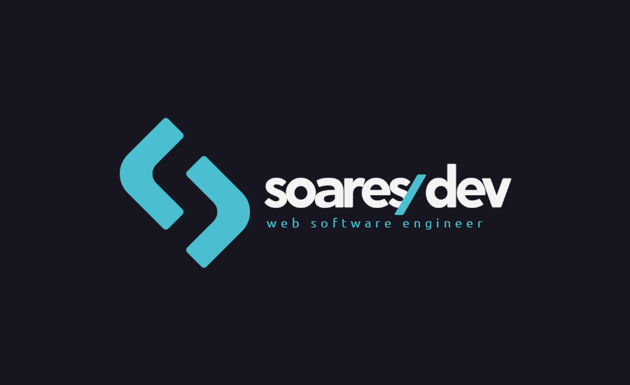

<div align="center" style="margin-bottom: 20px;">
  <div>
    
  </div>

  <div align="center">
    
    
    
    
  </div>
</div>

## :memo: About project

Welcome to the repository of SoaresDev.com, my personal portfolio highlighting my experience as a Web Software Engineer. This project encapsulates my professional journey, skills in modern technologies, and open-source projects.

## :rocket: Technologies

-   [Next.js](https://nextjs.org/)
-   [TypeScript](https://www.typescriptlang.org/)
-   [Tailwind CSS](https://tailwindcss.com/)
-   [Resend](https://resend.com/docs/introduction)
-   [Framer Motion](https://www.framer.com/motion/)
-   [React Type Animation](https://react-type-animation.netlify.app/)
-   [Lucide](https://lucide.dev/guide/packages/lucide-react)
-   [Joi](https://joi.dev/api/?v=17.12.2)
-   [Toastify](https://fkhadra.github.io/react-toastify/introduction/)

## :cyclone: Run this project

```bash
# Clone this project
$ git clone git@github.com:jefferson1104/soaresdev.com.git

# Project directory
$ cd soaresdev.com

# Install dependencies
$ npm install

# run the project as development mode
$ npm run dev

# open in your browser
http://localhost:3000
```
